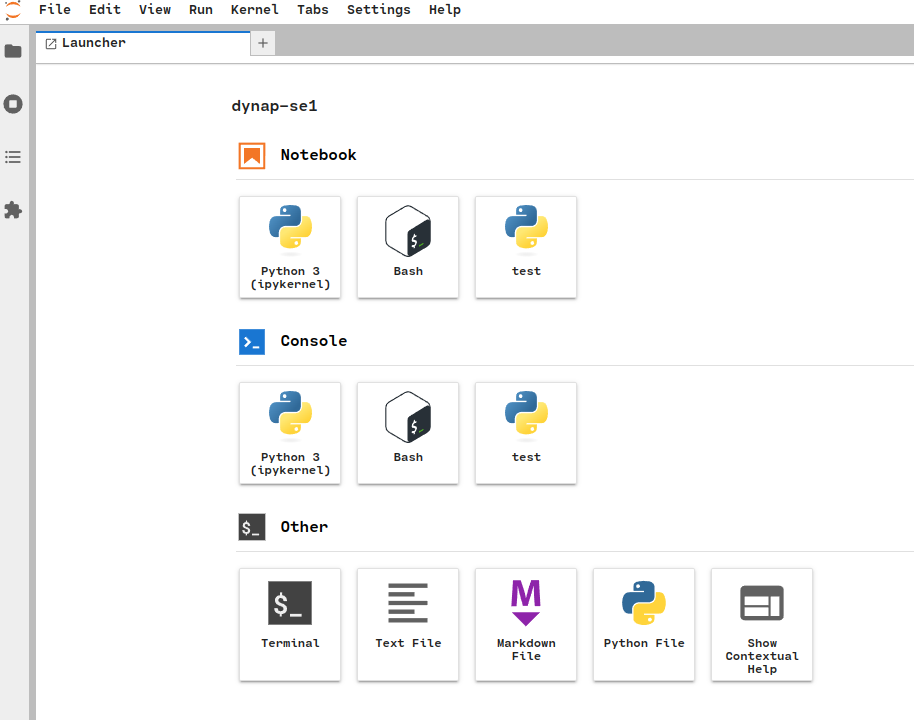
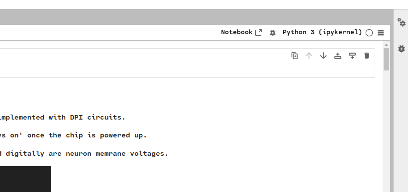

This repository is provided by the Institute of Neuroinformatics (INI) and offers Python-based extentions of Samna API ((c) SynSense) specifically for mixed-signal analog-digital DYNAP-SE1 chips.

The code allows users to **configure networks** of spiking neurons on the chip, **set the parameters** of the analog synapse and neuron circuits (time constants, refractory periods, weights, gains, etc.), **send input spike trains** and **record the activity** of the physical on-chip neurons. The repository also contains the [introductory guiding materials](https://code.ini.uzh.ch/ncs/libs/dynap-se1/-/blob/main/Samna_demo.ipynb) to introduce new users to the framework, as well as a few basic code [examples](https://code.ini.uzh.ch/ncs/libs/dynap-se1/-/blob/main/example) that can be used as starting points for projects.

**Note**: DYNAP-SE1 software is written and tested to operate under **Ubuntu**. However, it is possible to enable partial or even full functionality on **MacOS** or on Windows using **WSL**. _The latter options, however, may raise system-specific problems and are not the priority of the development._

The following sections cover installation, setup and usage of the DYNAP-SE1 software framework:

- [Chip introduction](#introduction)
- [Access to DYNAP-SE1 chips](#access-to-dynap-se1-boards)
- [Getting started](#getting-started)
- [Inventory](#inventory)
- [Documentation](#documentation)
- [Tutorials and demos]()

- [FAQ and Known Issues](#frequently-asked-questions-and-known-issues)
Frequently asked questions (FAQ) and known issues
# Introduction

Useful links to learn about DYNAP-SE1 chip:

- DYNAP-SE1 chip functionality [`introduction video`](https://www.youtube.com/watch?v=NoSPNOGYVMY) on YouTube

- The neuron and synapse circuits implemented on the DYNAP-SE1 chip are
published and analysed in the paper [`Chicca et al. 2014`](https://ieeexplore.ieee.org/document/6809149).

- The asynchronous routing scheme and characterization of the DYNAP-SE1 chip is published in [`Moradi et al. 2017`](https://ieeexplore.ieee.org/document/8094868)

- The on-chip parameter heterogeneity characterization and coping strategies for robustness of computation are published in [`Zendrikov et al. 2023`](https://iopscience.iop.org/article/10.1088/2634-4386/ace64c)


# Access to DYNAP-SE1 boards

**DYNAP-SE1** boards can be used in 3 different scenarios:
1. **Remote** *(VPN, SSH, recommended)*: The user connects to the **ZEMO** server at **INI** using **SSH** through the VPN access provided by the **University of Zurich** (UZH) that has several DYNAP-SE1 boards attached.
To record the analog membrane voltage traces, the built-in SPCM card should be used.
      - Please drop an e-mail to `support@ini.uzh.ch` if you need to use the VPN. Every user needs to be registered to INI-database to use the server.
      - Make sure to **use the [booking system](https://teamup.com/kszuuhkh7ss24gerzz)**
2. **Local** *(USB)*: The chip is connected the user's personal machine. This way the online GUI is available to monitor the spiking activity of the board,
and any other oscilloscope could be used to monitor the membrane voltages.

3. **Local** *(Zemo)*: The user logs into their account on the **ZEMO** server at INI in person, gaining access to the GUI functionality of
the Ubuntu system installed there.


# Getting Started

0. **`Remote only`**: [Login to Zemo](#connecting-to-vpn-and-zemo)
(*and run all following instructions on Zemo*)

1. Create a virtual environment and attach the kernel (**conda** recommended)
  - using **conda**:
    - To Install **Conda** at `$HOME` folder (on Linux; ignore if you already have it):
      - `wget https://repo.anaconda.com/miniconda/Miniconda3-latest-Linux-x86_64.sh -O ~/miniconda.sh && bash ~/miniconda.sh -b -p ~/miniconda && rm ~/miniconda.sh`
      - `echo export PATH="$HOME/miniconda/bin:$PATH"' >> ~/.bashrc`
      - `source ~/.bashrc`
      - create an environment named "dynapse1": `conda create -n dynapse1 python=3.8 jupyter pip ipython ipykernel bash_kernel -y`
       activate the environment: `conda activate dynapse1`

    - Make the ipykernel with the created environment by running:
      - `ipython kernel install --user --name=dynapse1 --display-name "DYNAP-SE1 Kernel"`
      - `python -m ipykernel install --user --name=dynapse1 --display-name "DYNAP-SE1 Kernel"`
      - `python -m bash_kernel.install`

2. Install Samna **version 0.17**:

    - `pip install samna==0.17` (**0.17.4 for Mac**)
    - **for local access (Linux, Mac, WSL)** follow the additional [installation instructions](https://synsense-sys-int.gitlab.io/samna/install.html) enabling USB port access depending on your system.


3. Git-clone this DYNAP-SE1 Repository

  ```
  git clone https://code.ini.uzh.ch/ncs/libs/dynap-se1.git
  ```
and then import and update the submodules with

  ```
  git submodule init
  git submodule update
  ```

4. Start the Jupyter notebook server:
`jupyter lab --no-browser --port=8080 --ip=0.0.0.0`

5. Accesing the server on you local machine (*this is to be run in the local machine browser*)</br>`http://ncs-zemo.lan.ini.uzh.ch:8080/tree/tree?token=-----` with using the token that you generated in Zemo
      - You should be greeted with the follwoing welcome screen. You can use the `test` on top-right to start a new notebook with the test kernel.
      
      - If you want to open and work with `Samna_demo.ipynb`, you can open that from file explorer on left-side of the Jupyter Lab. 
      - Remember to change the kernel from top-right **after openning the Samna_demo notebook**.
      

      - Alternatively, **VS Code** can be used to interact with the Jupyter server. Use the URL to the Jupyter Server obtained above to connect to the remote kernel (the full explanation how to attach a kernel is [here](https://code.visualstudio.com/docs/datascience/jupyter-notebooks#_connect-to-a-remote-jupyter-server))

6. Try to run the [`Introductory Jupyter Notebook with the basic functionality rundown`](https://code.ini.uzh.ch/ncs/libs/dynap-se1/-/blob/main/Samna_demo.ipynb) - the main introduction to this repository

7. Take a looke at the guide [`How to Set up Biases`](dynapse-biases-howtosetup.md) - A guide to the logic behind setting the biases of the chip


**Additional useful commands:**

- Map remote directory to local folder: 
`sshfs username@:ncs-zemo.ini.uzh.ch/home/username/dir_name local_directory`

- To copy (same PC) `cp -R <source_folder> <destination_folder>`

- To copy (remote PC) `scp username@ncs-zemo.ini.uzh.ch:/dir_path/Hello_world* /dir_path/folder_name`

# Inventory

- [`Google spreadsheet for DYNAP-SE1 Inventory`](https://docs.google.com/spreadsheets/d/1nH2ihmJopggJwHB5A8NmtKlDbAkQdN7nsJvuaCBwr5c/edit?usp=sharing)

# Booking System 
- [`Team-up Booking for access to DYNAP-SE1`](https://teamup.com/kszuuhkh7ss24gerzz)

[//]: # (explanation of relation of Samna to CTXCTL_Contrib to this.)


# Documentation

- The main DYNAP-SE1 repository [documentation PDF](doc/samna-dynapse1-doc.pdf) (_slightly outdated_)

- DYNAP-SE1 chip functionality [`introduction video`](https://www.youtube.com/watch?v=NoSPNOGYVMY) on YouTube

- The documentation for Samna is [here](https://synsense-sys-int.gitlab.io/samna/);
the DYNAP-SE1 related part is
[this section](https://synsense-sys-int.gitlab.io/samna/devkits/dynapSeSeries/dynapse1/summary.html).
- The documentation of this
[Python utilities library](https://code.ini.uzh.ch/ncs/libs/dynap-se1) for
Samna DYNAP-SE1 library in its online form is also [here](https://neuroinf.gitlab.io/ctxctl_contrib/).


[//]: # (- `Video tutorial from the course NI06 - Neuromorphic Processor https://tube.switch.ch/switchcast/uzh.ch/events/383ee32a-58b8-48d5-bed0-a915ce341961) 

- [`User Guide - DYNAP-SE1`](https://docs.google.com/document/d/e/2PACX-1vQV36QRWsQl4ROfvRo7mbHb5_ZQ4Q1Qw64AkfdhuPEtIXYq1kf_ZsD3-GZkYPKqrlkOiizCq-Jjt_kD/pub?urp=gmail_link&gxid=8203366) - **[LEGACY]:** **software examples are not relevant anymore. To be used for chip understanding only** - in-detail overview of the lower level chip behaviour with the legacy chip control software cAER.

## Related Repositories 
-------
- teili: [`pypi`](https://pypi.org/project/teili/), [`documentation`](https://teili.readthedocs.io/en/latest/) - a Brian2 library to model the on-chip circuit behaviour
- [`PyGetScope`](https://code.ini.uzh.ch/ncs/libs/pygetscope) library for working with Agilent scopes as a standalone repository (same as the included submodule here)
- [`PySpcmScope`](https://code.ini.uzh.ch/ncs/libs/pyspcmscope.git) library for working with on-board digitizer PCIE Card (M2i.3132-Exp) as a standalone repository (same as the included submodule here)


# Connecting to VPN and Zemo

First you need to have an INI username. If you don't have one, you need to get your INI supervisor to request one for you.

If you have an INI username, then you need to have access to INI network. If you need remote access or access via Wifi, you'll need to use a VPN. If you're not yet a user of INI's VPN, please drop an  e-mail to [`IT Support`](mailto:support@ini.uzh.ch?subject=VPN%20Access).

Next, you need an account on Zemo. Please drop an e-mail to [`Saptarshi Ghosh`](mailto:sapta@ini.uzh.ch?subject=Account%20on%20zemo).

Then setup the VPN to INI network for remote access to Zemo. Zemo can be accessed though ssh as `ssh <user name>@ncs-zemo.ini.uzh.ch`

## INI's VPN
#### TL;DR

- **On Windows 10** one can use [`FortiClient-Win10`](https://www.microsoft.com/en-us/p/forticlient/9wzdncrdh6mc?activetab=pivot:overviewtab) 
- **On Linux** we suggest you install the *openfortivpn* package and run VPN via the following command, replacing <UZH-shortname> with your UZH shortname:

 ```bash
  sudo openfortivpn sslvpn.ini.uzh.ch:10443 -u <UZH Shortname>  --trusted-cert 73771a1626625472674e4b8b907b8a97b870394746c4071b0e54ea3cc3479a93
  ```
Note that you need to use UZH credentials, i.e. UZH shortname and password, not INI credentials, as this service is provided by UZH. openfortivpn is also solution when you need command line VPN. It is possible to set up fortivpn via the package network-manager-fortisslvpn-gnome that makes it available to the gnome network manager (might need reboot or restart of network-manager service after install of package). 

### Excerpt from [INI WIKI](https://services.ini.uzh.ch/wiki/index.php/VPN):
You’ll need to use a new VPN server provided for INI by UZH. The UZH is using a VPN solution from Fortinet. The name of the server is sslvpn.ini.uzh.ch (130.60.23.50) port 10443. For some clients this may be entered as <tt>sslvpn.ini.uzh.ch:10443</tt>.  Remember this is now a UZH service so please make sure to login with your UZH credentials (not INI). Clients for almost all system are available [`from here`](https://forticlient.com/downloads). If you do not have a UZH account, please contact [`Pawel Pyk`](mailto:ppyk@ini.uzh.ch?subject=UZH%20Account)

If it does not work with that method (DNS problem), edit the VPN connection, go to IPv4 and add the following two DNS servers (instead of automatic): *130.60.128.3*,*130.60.64.51*


# Frequently asked questions and known issues

  - Requires replug\reset:

    - no device connected - check that the DYNAP-SE1 board is
    listed by `lsusb`. The USB udev rules might need to be set (Ubuntu) or the device needs to be attached again (WSL).
    - Store ID error - restart the python kernel
    - Store name taken error - instance of Samna already exists with the opened device model - restart the python kernel
    - Core shutdown (overload) - likely happens because of excessive spiking activity of the core
    - Libcaer\libusb errors:
      - `CRITICAL: Dynap-se ID-0 SN-00000002 [1:11]: failed to start data transfers`
      - `RuntimeError: Dynap-se ID-0 SN-00000002 [1:11]: failed to set configuration parameter, modAddr=16, paramAddr=0, param=1.`
    - Netgen new configuration overrides the biases so they need to be copied
    
  - Known usolved Samna-side issues:
    - **Device selection (when multiple connected)** - the first one is always selected
    - **Doubled FPGA input** [(Issue #2)](https://code.ini.uzh.ch/ncs/libs/dynap-se1/-/issues/2) - in `RepeatMode==False` the spike generator plays the preloaded sequence twice. This is a known firmware issue.
    - 

