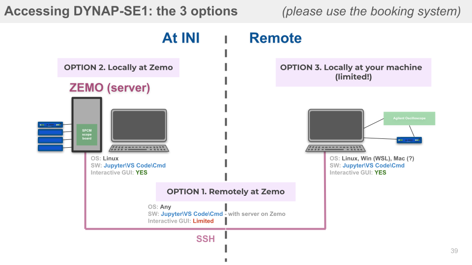

This repository is provided by the Institute of Neuroinformatics (INI) and offers Python-based extentions of Samna API ((c) SynSense) specifically for mixed-signal analog-digital DYNAP-SE1 chips.

The code allows users to **configure networks** of spiking neurons on the chip, **set the parameters** of the analog synapse and neuron circuits (time constants, refractory periods, weights, gains, etc.), **send input spike trains** and **record the activity** of the physical on-chip neurons. The repository also contains the [introductory guiding materials](https://code.ini.uzh.ch/ncs/libs/dynap-se1/-/blob/main/Samna_demo.ipynb) to introduce new users to the framework, as well as a few basic code [examples](https://code.ini.uzh.ch/ncs/libs/dynap-se1/-/blob/main/examples) that can be used as starting points for projects.

**Note**: DYNAP-SE1 software is written and tested to operate under **Ubuntu**. However, it is possible to enable partial or even full functionality on **MacOS** or on Windows using **WSL**. _The latter options, however, may raise system-specific problems and are not the priority of the development._

The following sections cover installation, setup and of the DYNAP-SE1 software framework:

- [Access to DYNAP-SE1 chips](#)
- [Getting started](#getting-started)
- [Installation]()
- [Documentation]()
- [Tutorials and demos]()


# Access to DYNAP-SE1 boards

**DYNAP-SE1** boards can be used in 3 different scenarios:
1. **Remote** *(VPN, SSH, recommended)*: The user connects to the **ZEMO** server at **INI** using **SSH** through the VPN access provided by the **University of Zurich** (UZH) that has several DYNAP-SE1 boards attached.
2. **Local** *(USB)*: The chip can 



# Getting Started
1. [Login to Zemo](#connecting-to-vpn-and-zemo)
(*and all following instructions are to be run on Zemo*)
1. [Git-clone the Dy1 Repository](#git-repository-cloning)
1. Creating a Virtual environment (virtualenv recommended)
- using ** virtualenv**
  - pip install --user virtualenv
  - python3 -m virtualenv test
  - source test/bin/activate
- Using ** python3-venv ** 
  - python3 -m venv test --without-pip
  - source test/bin/activate
4. Installing Jupyter, [samna](#samna-details) and other dependencies
    - pip install jupyter
    - pip install samna==0.17

    - pip install ipython
    - pip install ipykernel
    - ipython kernel install --user --name=test
    - python -m ipykernel install --user --name=test

    - pip install bash_kernel
    - python -m bash_kernel.install
5. Starting jupyter notebook server
`jupyter notebook --no-browser --port=8080 --ip=0.0.0.0`
6. Accesing the server in you local machine (*this is to be run on local machine browser*)</br>`http://ncs-zemo.lan.ini.uzh.ch:8080/tree/tree?token=-----` with using whatever token that you generated in Zemo

7. [`Introductory Jupyter Notebook with the basic functionality rundown`](https://code.ini.uzh.ch/ncs/libs/dynap-se1/-/blob/main/Samna_demo.ipynb) - the main introduction to this repository

8. [`How to Set up Biases`](dynapse-biases-howtosetup.md) - A guide to logic behind setting the biases of the chip


**Additional useful commands:**

- Map remote directory to local folder: 
`sshfs username@:zemo.lan.ini.uzh.ch/home/username/dir_name local_directory`

- To copy (same PC) `cp -R <source_folder> <destination_folder>`

- To copy (remote PC) `scp username@zemo.lan.ini.uzh.ch:/dir_path/Hello_world* /dir_path/folder_name`

Inventory
-------
- [`Google spreadsheet for DYNAP-SE Inventory`](https://docs.google.com/spreadsheets/d/1nH2ihmJopggJwHB5A8NmtKlDbAkQdN7nsJvuaCBwr5c/edit?usp=sharing)

Booking-System 
-------
- [`Team-up Booking for access to dynapse1`](https://teamup.com/kszuuhkh7ss24gerzz)

[//]: # (explanation of relation of Samna to CTXCTL_Contrib to this.)


# Documentation 
- The documentation for Samna is [here](https://synsense-sys-int.gitlab.io/samna/);
the DYNAP-SE1 related part is
[this section](https://synsense-sys-int.gitlab.io/samna/devkits/dynapSeSeries/dynapse1/summary.html).
- The documentation of this
[Python utilities library](https://code.ini.uzh.ch/ncs/libs/dynap-se1) for
Samna for DYNAP-SE1 is [here](https://neuroinf.gitlab.io/ctxctl_contrib/).

  ---
  **NOTE**

  The automatically generated API documentation for this library may still have some issues being displayed in
  [Modules](https://neuroinf.gitlab.io/ctxctl_contrib/contents/modules.html) and
  [APIs Summary](https://neuroinf.gitlab.io/ctxctl_contrib/contents/api_sum.html). To compile the latest
  doc locally, please follow this [How to compile the doc?](#how-to-compile-the-doc) section.
  The PDF version of the manual is at the
  [samna-dynapse1-doc](https://gitlab.com/neuroinf/ctxctl_contrib/-/tree/samna-dynapse1-doc)
  branch of this repository, which might be a bit
  out-dated compared to the compiled one. 

  ---

[//]: # (- `Video tutorial from the course NI06 - Neuromorphic Processor https://tube.switch.ch/switchcast/uzh.ch/events/383ee32a-58b8-48d5-bed0-a915ce341961) 

- [`User Guide - DYNAP-SE1`](https://docs.google.com/document/d/e/2PACX-1vQV36QRWsQl4ROfvRo7mbHb5_ZQ4Q1Qw64AkfdhuPEtIXYq1kf_ZsD3-GZkYPKqrlkOiizCq-Jjt_kD/pub?urp=gmail_link&gxid=8203366) - **[LEGACY]:** **software examples are not relevant anymore. To be used for chip understanding only** - in-detail overview of the lower level chip behaviour with the legacy chip control software cAER.

## Related Repositories 
-------
- teili: [`pypi`](https://pypi.org/project/teili/), [`documentation`](https://teili.readthedocs.io/en/latest/) - a Brian2 library to model the on-chip circuit behaviour
- [`PyGetScope`](https://code.ini.uzh.ch/ncs/libs/pygetscope) library for working with Agilent scopes as a standalone repository (same as the included submodule here)
- [`PySpcmScope`](https://code.ini.uzh.ch/ncs/libs/pyspcmscope.git) library for working with on-board digitizer PCIE Card (M2i.3132-Exp) as a standalone repository (same as the included submodule here)


# Samna
Install Samna version 0.17 (verified to work with this repository)

  ```
  pip install samna==0.17
  ```

See more details in the [install](https://synsense-sys-int.gitlab.io/samna/install.html) section of Samna documentation. You will also need [`Numpy`](https://numpy.org/install/) and [`Matplotlib`](https://matplotlib.org/stable/index.html)for basic usage. 

# Git Repository Cloning
First clone the repository to get all the necessary files
```
git clone git@code.ini.uzh.ch:ncs/libs/dynap-se1.git
```
and then import and update the submodules with 

  ```
  git submodule init
  git submodule update
  ```

Now you should have all the files needed to work with the DY1 Bluebox system.

## Papers

- [`Paper with DPI equations`](https://ieeexplore.ieee.org/document/6809149)


# Connecting to VPN and Zemo

First you need to have an INI username. If you don't have one, you need to get your INI supervisor to request one for you.

If you have an INI username, then you need to have access to INI network. If you need remote access or access via Wifi, you'll need to use a VPN. If you're not yet a user of INI's VPN, please drop a mail to [`Pawel Pyk`](mailto:ppyk@ini.uzh.ch?subject=VPN%20Access).

Next, you need an account on Zemo. Please drop a mail to [`Saptarshi Ghosh`](mailto:sapta@ini.uzh.ch?subject=Account%20on%20zemo).

Then setup the VPN to INI network for remote access to Zemo.

## INI's VPN
#### TL;DR

**On Windows 10** you can use [`FortiClient-Win10`](https://www.microsoft.com/en-us/p/forticlient/9wzdncrdh6mc?activetab=pivot:overviewtab) 
**On linux** we suggest you install the *openfortivpn* package and run VPN via the following command, replacing <UZH-shortname> with your UZH shortname:

 ```bash
  sudo openfortivpn sslvpn.ini.uzh.ch:10443 -u <UZH Shortname>  --trusted-cert 73771a1626625472674e4b8b907b8a97b870394746c4071b0e54ea3cc3479a93
  ```
Note that you need to use UZH credentials, i.e. UZH shortname and password, not INI credentials, as this service is provided by UZH. openfortivpn is also solution when you need command line VPN. It is possible to set up fortivpn via the package network-manager-fortisslvpn-gnome that makes it available to the gnome network manager (might need reboot or restart of network-manager service after install of package). 

### Excerpt from [`INI WIKI`](https://services.ini.uzh.ch/wiki/index.php/VPN)
You’ll need to use a new VPN server provided for INI by UZH. The UZH is using a VPN solution from Fortinet. The name of the server is sslvpn.ini.uzh.ch (130.60.23.50) port 10443. For some clients this may be entered as <tt>sslvpn.ini.uzh.ch:10443</tt>.  Remember this is now a UZH service so please make sure to login with your UZH credentials (not INI). Clients for almost all system are available [`from here`](https://forticlient.com/downloads). If you do not have a UZH account, please contact [`Pawel Pyk`](mailto:ppyk@ini.uzh.ch?subject=UZH%20Account)

If it does not work with that method (DNS problem), edit the VPN connection, go to IPv4 and add the following two DNS servers (instead of automatic): *130.60.128.3*,*130.60.64.51*


# How to compile the doc
- To compile the sphinx doc in this repository, install [sphinx](
https://www.sphinx-doc.org/en/master/) following the instructions
[here](https://www.sphinx-doc.org/en/master/usage/installation.html).

```bash
python -m pip install sphinx sphinx_book_theme sphinx-autodoc-typehints sphinxcontrib-napoleon
```
- Then go to the `doc` folder and compile the document into html or PDF format.
  - html:

    ```
    cd doc
    make html
    ```
    The html files will be generated under `doc/build/html`.

  - PDF:
    ```
    cd doc
    make latexpdf
    ```
    The PDF file `samna-dynapse1.pdf` will be generated under `doc/build/latex`.
       
